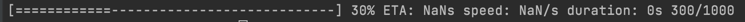
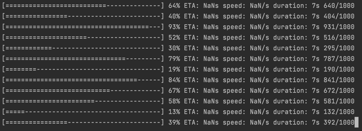

cli progress bar

# Installation

```sqlite-psql
$ npm install  FIXME
```

# How to use

## Simple bar
```
const progress = new Progress({ total: 1000 });

const bar = new Bar([progress]);

progress.increment(300);

bar.renderBars();
```



# Multi bars

```sqlite-psql
const progresses: Progress[] = [];
for (let i = 0; i < 30; i++) {
  const progress = new Progress({ total: 1000 });
  progress.increment(Math.floor(Math.random() * 1000));
  progresses.push(progress);
}

const bar = new Bar(progresses);

bar.start().catch(console.error);
```



