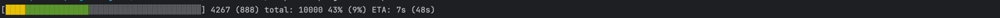
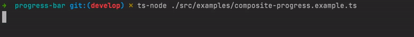
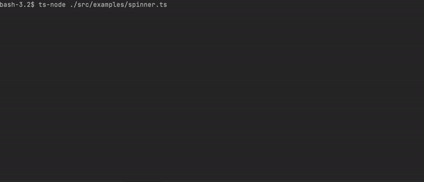

# Installation

```
$ npm install  ku-progress-bar
```

# Overview

## Simple bar
```typescript
import { Bar, Progress } from 'ku-progress-bar';
import { loopProgresses } from '../helpers/loop-progresses';

const progress = new Progress({ total: 1000 });

const bar = new Bar().addProgress(progress);

bar.start();

loopProgresses([progress], { getDelay: () => 5 });
```
see [simple-start.example.ts](src/examples/current/simple-start.example.ts)

```console
✗ ts-node src/examples/current/simple.example.ts
[===============================---------] 78% ETA: 1s speed: 178/s duration: 4s 777/1000
```

## Bar Presets

```typescript
import { Bar, BarItem, presets, Progress } from 'ku-progress-bar';
import { loopProgresses } from '../helpers/loop-progresses';

const bar = new Bar();
const progress = new Progress({ total: 100 });
bar.start();

for (const presetKey of Object.keys(presets)) {
  const presetName = presetKey.padEnd(7, ' ');
  bar.add(
    new BarItem(progress, {
      options: presets[presetKey],
      template: ({ bar, percentage, eta, speed, duration, value, total }) =>
        ` ${presetName} [${bar}] ${percentage} ETA: ${eta} speed: ${speed} duration: ${duration} ${value}/${total}`,
    }),
  );
}

loopProgresses([progress]);
```
see [presets-simple.example.ts](src/examples/presets/presets-simple.example.ts)

```console
✗ ts-node ./src/examples/presets.example.ts
 classic [============----------------------------] 31% ETA: 7s speed: 10/s duration: 3s 31/100
 shades  [████████████░░░░░░░░░░░░░░░░░░░░░░░░░░░░] 31% ETA: 7s speed: 10/s duration: 3s 31/100
 rect    [■■■■■■■■■■■■                            ] 31% ETA: 7s speed: 10/s duration: 3s 31/100
 braille [⣿⣿⣿⣿⣿⣿⣿⣿⣿⣿⣿⣿⣦⣀⣀⣀⣀⣀⣀⣀⣀⣀⣀⣀⣀⣀⣀⣀⣀⣀⣀⣀⣀⣀⣀⣀⣀⣀⣀⣀] 31% ETA: 7s speed: 10/s duration: 3s 31/100
```


## Multi bars


## Composite Progress bar
```typescript
import {
  Bar,
  BarsFormatter,
  BarItem,
  presets,
  Progress,
} from 'ku-progress-bar';
import * as chalk from 'chalk';
import { loopProgresses } from '../helpers/loop-progresses';

export const bar = new Bar().start();

const progresses = [
  new Progress({ total: 1000, start: 100 }),
  new Progress({ total: 1000 }),
];

bar.add(
  new BarItem(progresses, {
    options: {
      ...presets.shades,
      formatter: new BarsFormatter([chalk.green, chalk.yellowBright]),
    },
    template: (read, write) => {
      const readString = `read: ${read.value}/${read.total} ( ${read.percentage}% eta: ${read.etaHumanReadable})`;
      const writeString = `write: ${write.value}/${write.total} ( ${write.percentage}% eta: ${write.etaHumanReadable})`;
      return `[${read.bars}] ${chalk.green(readString)} ${chalk.yellowBright(
        writeString,
      )}`;
    },
  }),
);

loopProgresses(progresses);
```
see [composite-progress.example.ts](src/examples/composite-progress/composite-progress.example.ts)





# Documentation

## Bar Class

### public methods

- **`constructor`** ():
    Initializes a new instance of the `Bar` class.
- **`add`** (item: IBarItem):
    Adds a new progress bar item to the `Bar` instance.
- **`addProgress`** (progress: IProgress, params?: IParams):
    Adds a new progress bar item to the `Bar` instance.
- **`start`** ():
    Starts the progress bar rendering process.
- **`render`** ():
    Renders the progress bar.
- **`stop`** ():
    Stops the progress bar rendering process.
- **`clear`** ():
    Clears the progress bar from the console.
- **`remove`** (item: IBarItem):
    Removes a progress bar item from the `Bar` instance.
- **`removeByProgress`** (progress: IProgress):
    Removes a progress bar item from the `Bar` instance.
- **`getItems`** ():
    Returns an array of all progress bar items in the `Bar` instance.
- **`isStarted`** ():
    Returns a boolean value indicating whether the progress bar rendering process is started.
- **`refresh`** ():
    Refreshes the progress bar rendering process.
- **`wrapLogger`** (logger: ILogger):
    Wraps a logger with the progress bar rendering process.
- **`wrapLog`** (log: ILog):
    Wraps a log with the progress bar rendering process.

## BarItem Class

## Parameters of the `BarItem` class:
- **`progresses`** (`IProgress | IProgress[]`):
    An object or an array of objects of type `IProgress` representing the progress.
- **`params`** (`IParams | undefined`):
    Additional parameters to customize the appearance and behavior of the progress bar.
    - **`template`** (`function | undefined`): Template for displaying the progress bar.
    - **`options`** (`Partial<IBarOptions> | undefined`): Configuration settings for displaying the progress bar.
    - **`dataProviders`** (`Record<string, { getData:  ( progress: IProgress, progresses: IProgress[], ) => unknown } > | undefined`)

# Spinners example
[src/examples/spinner.example.ts](src/examples/legacy/spinner.example.ts)


