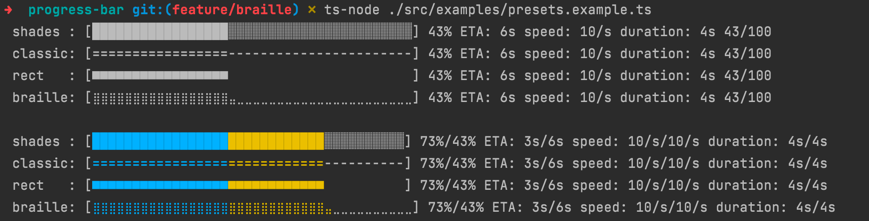
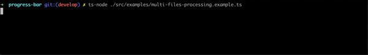

**ku-progress-bar**

***

# Installation

```
$ npm install  ku-progress-bar
```

# Overview

## Simple bar
```typescript
import { Progress, Bar } from 'ku-progress-bar';
import { loopProgresses } from '../helpers/loop-progresses';

const progress = new Progress({ total: 1000 });

new Bar().addProgress(progress).start();

loopProgresses([progress], () => 5);
```

```console
✗ ts-node src/examples/current/simple.example.ts
[===============================---------] 78% ETA: 1s speed: 178/s duration: 4s 777/1000
```

## Bar Presets

```typescript
import { Bar, BarItemLegacy, presets, Progress } from 'ku-progress-bar';
import * as chalk from 'chalk';

const bar = new Bar();
const progress = new Progress({ total: 100 });

bar.add(new BarItemLegacy(progress, {
  options: presets.braille,
}));

bar.start();

```

```console
✗ ts-node ./src/examples/presets.example.ts
 classic [============----------------------------] 31% ETA: 7s speed: 10/s duration: 3s 31/100
 shades  [████████████░░░░░░░░░░░░░░░░░░░░░░░░░░░░] 31% ETA: 7s speed: 10/s duration: 3s 31/100
 rect    [■■■■■■■■■■■■                            ] 31% ETA: 7s speed: 10/s duration: 3s 31/100
 braille [⣿⣿⣿⣿⣿⣿⣿⣿⣿⣿⣿⣿⣦⣀⣀⣀⣀⣀⣀⣀⣀⣀⣀⣀⣀⣀⣀⣀⣀⣀⣀⣀⣀⣀⣀⣀⣀⣀⣀⣀] 31% ETA: 7s speed: 10/s duration: 3s 31/100
```



## Multi bars

```typescript
const bar = new Bar();
for (let i = 0; i < 7; i++) {
  bar.addProgress(
    new Progress({ total: 1000 }).increment(Math.floor(Math.random() * 1000)),
  );
}
bar.render();

```

TODO: add image



## Composite Progress bar
```typescript
export const bar = new Bar().start();
const progresses = [
  new Progress({ total: 1000, start: 300 }),
  new Progress({ total: 1000 }),
];
bar.add(
  new BarItemLegacy(
    progresses,
    {
      options: presets.shades,
      formatters: {
        bars: new BarsFormatter([chalk.green, chalk.yellowBright]),
      },
    },
  ),
);
```


# Documentation

## Bar Class

### public methods

- **`constructor`** ():
    Initializes a new instance of the `Bar` class.
- **`add`** (item: IBarItem):
    Adds a new progress bar item to the `Bar` instance.
- **`addProgress`** (progress: IProgress, params?: IParams):
    Adds a new progress bar item to the `Bar` instance.
- **`start`** ():
    Starts the progress bar rendering process.
- **`render`** ():
    Renders the progress bar.
- **`stop`** ():
    Stops the progress bar rendering process.
- **`clear`** ():
    Clears the progress bar from the console.
- **`remove`** (item: IBarItem):
    Removes a progress bar item from the `Bar` instance.
- **`removeByProgress`** (progress: IProgress):
    Removes a progress bar item from the `Bar` instance.
- **`getItems`** ():
    Returns an array of all progress bar items in the `Bar` instance.
- **`isStarted`** ():
    Returns a boolean value indicating whether the progress bar rendering process is started.
- **`refresh`** ():
    Refreshes the progress bar rendering process.
- **`wrapLogger`** (logger: ILogger):
    Wraps a logger with the progress bar rendering process.
- **`wrapLog`** (log: ILog):
    Wraps a log with the progress bar rendering process.

## BarItem Class

## Parameters of the `BarItem` class:
- **`progresses`** (`IProgress | IProgress[]`):
    An object or an array of objects of type `IProgress` representing the progress.
- **`params`** (`IParams | undefined`):
    Additional parameters to customize the appearance and behavior of the progress bar.
    - **`template`** (`function | undefined`): Template for displaying the progress bar.
    - **`options`** (`Partial<IBarOptions> | undefined`): Configuration settings for displaying the progress bar.
    - **`dataProviders`** (`Record<string, { getData:  ( progress: IProgress, progresses: IProgress[], ) => unknown } > | undefined`)

# deprecated
## Parameters of the `BarItem` class:

1.  **`progresses`** (`IProgress | IProgress[]`):
   An object or an array of objects of type `IProgress` representing the progress.

2.  **`params`** (`IParams | undefined`):
   Additional parameters to customize the appearance and behavior of the progress bar.
    -   **`template`** (`function | undefined`): Template for displaying the progress bar.
    -   **`options`** (`Partial<IBarOptions> | undefined`): Configuration settings for displaying the progress bar.
    -   **`dataProviders`** (`Record<string, { getData:  ( progress: IProgress, progresses: IProgress[], ) => unknown } > | undefined`)

### Template Format:

[src/examples/spinner.example.ts](_media/spinner.example.ts)

```typescript
bar.add(
  new BarItemLegacy(progress, {
    template:
      '[{bar}] {spinner} {percentage} ETA: {eta} speed: {speed} duration: {duration} {value}/{total} (task: {task})',
    dataProviders: {
      spinner: () => spinner.next().value,
    },
  }),
);
// or
bar.add(
  new BarItemLegacy<never, { spinner: () => string }>(progress, {
    template: ({ bar, percentage, eta, speed, duration, value, total, spinner}) => {
      const task = progress.getPayload().task;
      return `[${bar}] ${spinner} ${percentage} ETA: ${eta} speed: ${speed} duration: ${duration} ${value}/${total} (task: ${task})`;
    },
    dataProviders: {
      spinner: () => spinner.next().value,
    },
  }),
);

```

In the `BarItemLegacy` class, the `template` represents a string template that defines how the progress bar will be displayed. In this template, you can use various placeholders that will substitute actual progress values into the resulting string.

Let's review some key placeholders you can use in the template:

-   `{bar}`: Placeholder for inserting the progress bar.
-   `{percentage}`:  Placeholder for inserting the progress percentage.
-   `{eta}`: Placeholder for inserting the estimated time of arrival (ETA).
-   `{etaHumanReadable}`: Placeholder for inserting the estimated time (ETA). (`2h47m30s`)
-   `{speed}`:   Placeholder for inserting the progress speed.
-   `{value}`: Placeholder for inserting the current value.
-   `{total}`: Placeholder for inserting the total value.

These placeholders are replaced with the actual progress values during the generation of the progress bar string.

For example, if you use the template `"{bar} {percentage}%"`, during the generation of the progress bar, you'll see a string that displays the progress bar and the progress percentage.

You can also use more complex templates that incorporate a combination of placeholders and additional text to achieve a specific look and informativeness for the progress bar.

For instance, a template `"[{bar}] Progress: {percentage}%, ETA: {eta}"` will display the progress bar, progress percentage, and the estimated time of arrival.

Additionally, if you pass a custom payload to `Progress`, it is also possible to use it in the template by using the same approach: `{payload_object_key_name}`.

Moreover, you can pass a `dataProviders` object as a parameter to `BarItemLegacy`. For example:

```typescript
const dataProviders = {
  customData: (progress, progresses) => renderCustomData(progress, progresses),
  // other data providers
};
```

You can then use it in the template like this:

```typescript
Custom Data: {[customData]}
```
This allows for dynamic and customizable progress bar templates based on the provided data and payload.

### example
```typescript
const bar = new Bar();
const progress = new Progress({ total: 100 }, { task: 'users creating...' });
function * Spinner(chars: string[], delay = 500): Generator<string> {
   let [ index, char, lastUpdate ] = [ 0, ' ', 0 ];
   while (true) {
      if (Date.now() - lastUpdate > delay) {
         index = index + 1 >= chars.length ? 0 : index + 1;
         char = chars.length ? chars[index] : '';
         lastUpdate = Date.now();
      }
      yield char;
   }
}
const spinner = Spinner([ '\\', '|', '/', '-']);
bar.add(new BarItemLegacy(progress, {
   template: '[{bar}] {spinner} {percentage} ETA: {eta} speed: {speed} duration: {duration} {value}/{total} (task: {task})',
   dataProviders: {
      spinner: () => spinner.next().value,
   },
}))
progress.increment(1, { task: 'permission granting...' });

const interval = setInterval(() => {
   if (progress.getProgress() >= 1) {
      clearInterval(interval);
   }
   progress.increment();
}, 50)
bar.start();
```

```console
[=====================-------------------] / 53% ETA: 2s speed: 19/s duration: 3s 53/100 (task: permission granting...)
```

### IBarOptions Interface:

The `IBarOptions` interface defines the configuration options for customizing the appearance of a progress bar.

#### Properties:

1.  **`completeChar`** (`string`):
    -   The character used to represent the completed portion of the progress bar.

2.  **`resumeChar`** (`string`):
    -   The character used to represent the remaining portion of the progress bar that needs to be filled.

3.  **`width`** (`number`):
    -   The total width of the progress bar, indicating the number of characters to use for the entire progress representation.

4.  **`glue`** (`string`):
    -   A string used to separate multiple progress bars if displayed together.

### Example Usage:

```typescript
const options: IBarOptions = {
  completeChar: '=',
  resumeChar: '-',
  width: 40,
  glue: ' ',
};
```

# Using tags

It is possible use tags in templates and formatters

```typescript
const progress = new Progress({ total: 100 });
progresses.push(progress);
bar.add(
  new BarItemLegacy(
    [progress, new Progress({ total: 100, start: 50, tag: 'red' })],
    {
      template:
        '[{bars}] {percentage} ETA: {eta} speed: {speed} duration: {duration} {red:value} {value}/{total}',
      tagDelimiter: ':',
      formatters: {
        'red:bar': str => chalk.red(str),
        bar: str => chalk.green(str),
      },
    },
  ),
);
```

# Spinners example
[src/examples/spinner.example.ts](_media/spinner.example.ts)


```html
¼ (U+00BC): Vulgar fraction one quarter
½ (U+00BD): Vulgar fraction one half
¾ (U+00BE): Vulgar fraction three quarters
⅓ (U+2153): Vulgar fraction one third
⅔ (U+2154): Vulgar fraction two thirds
⅕ (U+2155): Vulgar fraction one fifth
⅖ (U+2156): Vulgar fraction two fifths
⅗ (U+2157): Vulgar fraction three fifths
⅘ (U+2158): Vulgar fraction four fifths
⅙ (U+2159): Vulgar fraction one sixth
⅚ (U+215A): Vulgar fraction five sixths
⅛ (U+215B): Vulgar fraction one eighth
⅜ (U+215C): Vulgar fraction three eighths
⅝ (U+215D): Vulgar fraction five eighths
⅞ (U+215E): Vulgar fraction seven eighths
```